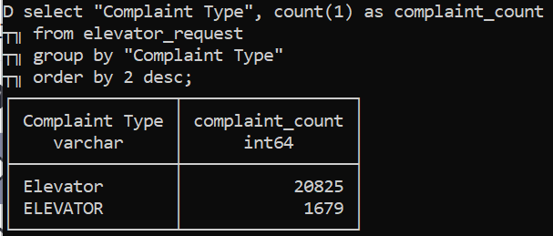
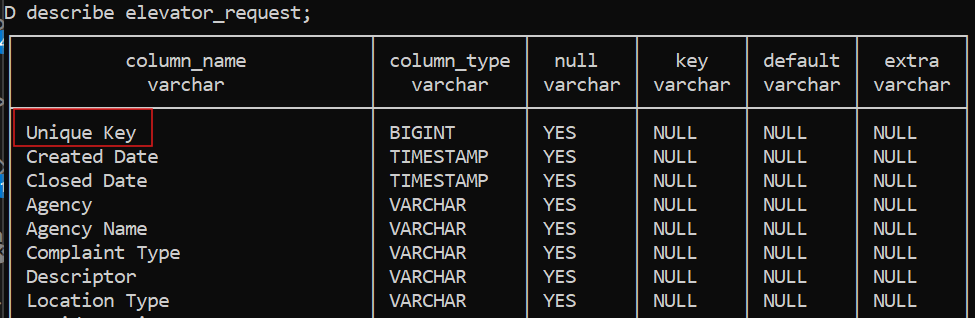
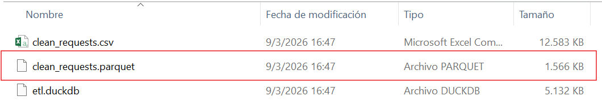

### **DuckDB Essentials** 
> Motivación: 

Este proyecto es un ejercicio de aprendizaje enfocado en la implementación de un flujo ELT (Extract, Load, Transform) utilizando DuckDB. 
El objetivo es demostrar la capacidad de procesar grandes volúmenes de datos de manera local, eficiente y con una sintaxis SQL amigable, transformando datos crudos en formatos listos para el análisis (Analytics Ready).  

**Por qué DuckDB:** 
- *OLAP In-Process:* No requiere de un servidor externo (Como Postgres o SQL Server), lo que facilita el desarrollo local y la integración en contenedores o funciones serverless. 
- *Rendimiento Vectorizado:* Optimizado para consultas analíticas sobre grandes conjuntos de datos. 
- *Interoperabilidad:* Capacidad nativa para leer y escribir directamente en Parquet, CSV y Pandas sin sobrecarga de memoria. 
- *Sintaxis SQL Moderna:* Soporte para funciones avanzadas como REPLACE en SELECT *, PIVOT, y lectura automática de esquemas.  

> Estructura del Proyecto: 

projects-duckdb/ 
├── data/                   # Datos crudos (CSV) a ser utilizados como source 
├── images/                 # Imagenes utilizadas para clarificar el cometido.  
├── scripts/                # Lógica del ELT en Python. 
├── outputs/                # Salidas o sinks generados. 
└── README.md  

> Flujo ELT 

El pipeline realiza las siguientes etapas: 
1. **Extract & Load:** Carga de datos crudos desde un CSV de más de 22.5k filas (311 Service Requests) directamente a una tabla persistente en DuckDB. 
2. **Transform (T):** 
&nbsp;&nbsp;&nbsp;&nbsp; - Normalización de categorías de texto.  
  
&nbsp;&nbsp;&nbsp;&nbsp; - Limpieza de Schema: Normalización programática de nombres de columnas (snake_case) usando Python + SQL.  
  
&nbsp;&nbsp;&nbsp;&nbsp; - Feature Engineering: Cálculo de closed_in_days utilizando funciones de fecha nativas de DuckDB. 
3. **Output Multi-formato:** Exportación de los datos procesados a tres destinos: 
&nbsp;&nbsp;&nbsp;&nbsp; - Relacional: Tabla persistente en el archivo .duckdb. 
&nbsp;&nbsp;&nbsp;&nbsp; - Intercambio: Archivo .csv normalizado. 
&nbsp;&nbsp;&nbsp;&nbsp; - Analítico: Archivo .parquet (comprimido y eficiente para Big Data).  

> Aprendizaje  

- **Eficiencia:** El procesamiento de limpieza y cálculo de columnas se realiza en milisegundos gracias al motor columnar. 
- **Simplicidad:** Se reemplazaron múltiples pasos de manipulación en Pandas por sentencias SQL directas, reduciendo la complejidad del código. 
- **Portabilidad:** El resultado final en formato Parquet redujo el tamaño del archivo original considerablemente, manteniendo la tipificación de los datos.  
 